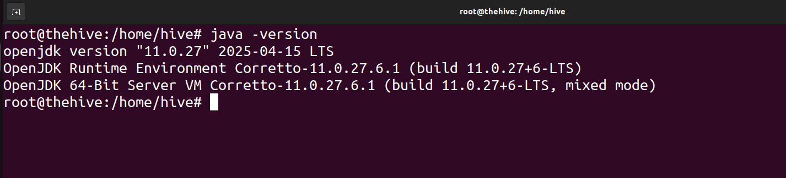

# TheHive Installation and Configuration

### Machines used

- Ubuntu

Hive installation is a six step process

# 1.Installing Dependencies

Open a terminal window. Run the following commands with sudo.

```jsx
sudo su
```

Enter your password then run this command

```jsx
apt install wget gnupg apt-transport-https git ca-certificates ca-certificates-java curl software-properties-common python3-pip lsb-release
```

# 2.Installing Java

Open a terminal window. Run the following commands.

```jsx
wget -qO- https://apt.corretto.aws/corretto.key | sudo gpg --dearmor -o /usr/share/keyrings/corretto.gpg
echo "deb [signed-by=/usr/share/keyrings/corretto.gpg] https://apt.corretto.aws stable main" | sudo tee -a /etc/apt/sources.list.d/corretto.sources.list
sudo apt update
sudo apt install java-common java-11-amazon-corretto-jdk
echo JAVA_HOME="/usr/lib/jvm/java-11-amazon-corretto" | sudo tee -a /etc/environment
export JAVA_HOME="/usr/lib/jvm/java-11-amazon-corretto"
```

Verify java installation

```jsx
java -version
```



# 3.**Cassandra installation and configuration**

### Installation

Open a terminal window. Run the following commands.

```jsx
wget -qO -  https://downloads.apache.org/cassandra/KEYS | sudo gpg --dearmor  -o /usr/share/keyrings/cassandra-archive.gpg
echo "deb [signed-by=/usr/share/keyrings/cassandra-archive.gpg] https://debian.cassandra.apache.org 40x main" |  sudo tee -a /etc/apt/sources.list.d/cassandra.sources.list
sudo apt update
sudo apt install cassandra
```

### Configuration

File path for Cassandra config file is `/etc/cassandra/cassandra.yaml`

```jsx
nano /etc/cassandra/cassandra.yaml
```

we need find the IP address of our Linux machine using the following commands:

```jsx
ip a
```


Set the `cluster_name` to a desired name.

`cluster_name: ‘mysoc’`


Set the `listen_address` to the IP address of your system.

l`isten_address: <IP addr>`


Set the `listen_address` to the IP address of your system.

`rpc_address: <IP addr>`


Set the `listen_address` to the IP address of your system.

`seed_provider: <IP addr>`


Save the file.

Stop Cassandra and remove any existing data.

```jsx
systemctl stop cassandra
rm -rf /var/lib/cassandra/*
```

Start Cassandra and enable it.

```jsx
systemctl start cassandra
systemctl enable cassandra
```

# 4.**ElasticSearch installation and configuration**

### **Installation**

Open a terminal window. Run the following commands.

```jsx
wget -qO - https://artifacts.elastic.co/GPG-KEY-elasticsearch |  sudo gpg --dearmor -o /usr/share/keyrings/elasticsearch-keyring.gpg
sudo apt-get install apt-transport-https
echo "deb [signed-by=/usr/share/keyrings/elasticsearch-keyring.gpg] https://artifacts.elastic.co/packages/7.x/apt stable main" |  sudo tee /etc/apt/sources.list.d/elastic-7.x.list
sudo apt update
sudo apt install elasticsearch
```

### **Configuration**

File path for ElasticSearch config file is `/etc/elasticsearch/elasticsearch.yml`

```jsx
nano /etc/elasticsearch/elasticsearch.yml
```

Uncomment `cluster.name` and `node.name`  and change cluster name.

`cluster.name: thehive`

`node.name: node-1`


Uncomment `network.host` and `cluster.initial_master_node` .Change network.host to ip address and cluster.initial_master_node to node-1 only.

`network.host: <IP addr>`

`cluster.initial_master_node: [”node-1”]`


Stop ElasticSearch and remove any existing data.

```jsx
systemctl stop elasticsearch
rm -rf /var/lib/elasticsearch/*
```

Start and enable ElasticSearch.

```jsx
systemctl start elasticsearch
systemctl enable elasticsearch
```

If there is an error do the following steps.

Create this file if it doesn’t exists.

```jsx
nano /etc/elasticsearch/jvm.options.d/jvm.options
```

Add the following in the file and save it.

```jsx
-Dlog4j2.formatMsgNoLookups=true
-Xms2g
-Xmx2g
```


Restart Elastic search.

```jsx
systemctl restart elasticsearch
```

# **5.TheHive installation and configuration**

### **Installation**

Open a terminal window. Run the following commands.

```jsx
wget -O- https://raw.githubusercontent.com/StrangeBeeCorp/Security/main/PGP%20keys/packages.key | sudo gpg --dearmor -o /usr/share/keyrings/strangebee-archive-keyring.gpg
echo 'deb [arch=all signed-by=/usr/share/keyrings/strangebee-archive-keyring.gpg] https://deb.strangebee.com thehive-5.4 main' |sudo tee -a /etc/apt/sources.list.d/strangebee.list
sudo apt-get update
sudo apt-get install -y thehive
```

### **Configuration**

File path for TheHive config file is `/etc/thehive/application.conf`

```jsx
nano /etc/thehive/application.conf
```

Change the `hostname` to system ip address and `cluster-name` to mysoc.

**Note:** The cluster-name should match with cluster-name of Cassandra.


Scroll down and replace localhost with ip address in  `application.baseUrl`. Uncomment lines containing CortexModule and MispModule in my case last two lines.


Save the file.

Start and enable TheHive.

```jsx
systemctl start thehive
systemctl enable thehive
```

If there is an error do the following steps.

```jsx
chown -R thehive:thehive /opt/thp/thehive
```

Restart Elastic search.

```jsx
systemctl restart thehive
```

# 6.Access TheHive

Open a web browser go to [](http://YOUR_SERVER_ADDRESS:9000/)http://YOUR_IP_ADDRESS:9000/ then a login page appears.


The default admin user credentials are as follows:

```jsx
Username: admin@thehive.local
Password: secret
```

Login with the default creds.


TheHive Dashboard apears.


